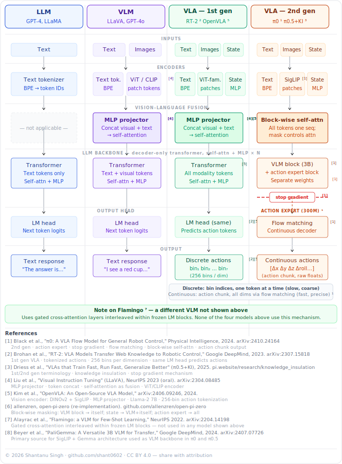

# PhysicalAI

Research and engineering repo for embodied AI — from large language models to Vision Language Action (VLA) models for robot control.

## Architecture Overview

The diagram below traces the evolution from pure language models to modern VLA systems capable of continuous robot control via flow matching.



### VLA Architecture Diagram
**© 2026 Shantanu Singh**  
github.com/shant0602

Comparative architecture diagram: LLM vs VLM vs VLA (1st gen) vs VLA (2nd gen).  
All claims cited to 8 primary academic sources.  
Licensed CC BY 4.0 — free to share with attribution.

## Repo Structure

```
PhysicalAI/
├── assets/          # Diagrams, figures
├── docs/            # Research notes, guides
├── src/
│   ├── models/      # LLM / VLM / VLA architectures
│   ├── data/        # Datasets, transforms, loaders
│   ├── training/    # Trainer, losses, schedulers
│   ├── inference/   # Policy wrapper, inference server
│   ├── robot/       # Sim envs, hardware drivers, control
│   ├── evaluation/  # Metrics, rollout harness
│   └── utils/       # Config, logging, checkpointing, viz
├── scripts/         # train.py, evaluate.py, collect_data.py
├── configs/         # Hydra YAML experiment configs
├── notebooks/       # Exploration and demos
└── tests/           # Unit and integration tests
```

## Setup

```bash
# Create and activate virtual environment
python -m venv .venv && source .venv/bin/activate

# Install package in editable mode
make install
```

## Usage

```bash
make train       # Launch training
make evaluate    # Run evaluation
make test        # Run test suite
make lint        # Lint + type-check
```

## LoRA Fine-Tuning on Lambda Labs

Fine-tunes OpenVLA-7B on the [LIBERO](https://lifelong-robot-learning.github.io/LIBERO/) `libero_spatial` task suite (~10GB) using the official OpenVLA LoRA pipeline.

### Prerequisites

- Lambda Labs A100 instance (or any NVIDIA GPU with ≥27GB VRAM)
- [W&B](https://wandb.ai) account for experiment tracking

### One-command setup

SSH into your Lambda instance and run:

```bash
REPO_URL=https://github.com/shant0602/PhysicalAI \
WANDB_KEY=<your-wandb-api-key> \
WANDB_ENTITY=<your-wandb-username> \
bash <(curl -s https://raw.githubusercontent.com/shant0602/PhysicalAI/feature/openvla-training-pipeline/scripts/setup_lambda.sh)
```

This will:
1. Clone the repo and initialise git submodules (OpenVLA, rlds_dataset_mod)
2. Download the LIBERO dataset (~10GB via HuggingFace git-lfs)
3. Build the `physicalai:train` Docker image (PyTorch 2.2, flash-attn, OpenVLA baked in)
4. Launch LoRA fine-tuning inside Docker (~2-3 hrs on A100)

Training config is in [`configs/training/libero_lora.env`](configs/training/libero_lora.env). Override any parameter inline:

```bash
MAX_STEPS=500 BATCH_SIZE=8 WANDB_ENTITY=myteam \
bash <(curl -s .../setup_lambda.sh)
```

### After training — evaluate

```bash
make eval-libero CHECKPOINT=runs/<your-run-dir>
```

Runs the official LIBERO simulation benchmark and reports task success rate on `libero_spatial`.

### Running locally (no Lambda)

```bash
make submodule-init
make download-libero                     # ~10GB
make docker-build-train
make docker-train-libero WANDB_ENTITY=<your-username>
```

## Roadmap

- [ ] LLM backbone implementations
- [ ] VLM vision encoders (ViT, SigLIP, CLIP, DINOv2)
- [ ] VLA action expert + flow matching decoder
- [ ] Open-X Embodiment dataset integration
- [ ] MuJoCo / Isaac Sim environment wrappers
- [ ] Real-robot hardware interface (ROS2)
- [ ] Evaluation harness + task success metrics

## License

GNU General Public License v3 — see [LICENSE](LICENSE).

---

*Author: Shantanu Singh*
