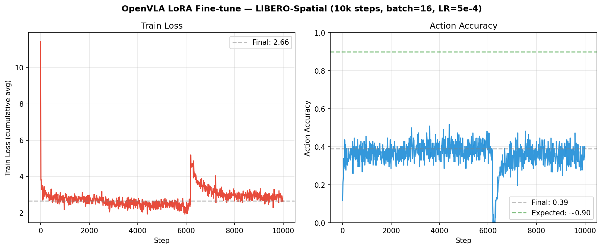
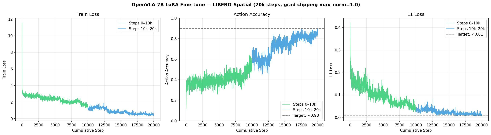

# 0% to 72%: Finding the Bug That Breaks OpenVLA Fine-Tuning

*One missing line in `finetune.py` causes mode collapse. Here's how I found it, fixed it, and contributed the fix back.*

---

After 10,000 training steps, my fine-tuned OpenVLA model achieved a 0% success rate on LIBERO-Spatial. Not 10%. Not 5%. Zero.

The strange part: the training loss had been decreasing. W&B showed action accuracy climbing to 0.39 by step 5,000. Everything looked like it was working — until it suddenly wasn't. At inference time, the robot arm output the exact same 7-token action sequence regardless of what it was looking at. Put a bowl in front of it: same tokens. Move the bowl: same tokens. Show it a completely different scene: same tokens.

This is mode collapse. And it had nothing to do with my data, my eval setup, or my hardware. It was a bug in the upstream training script used by everyone who fine-tunes OpenVLA.

---

## What I Was Building

[OpenVLA](https://github.com/openvla/openvla) is a 7B parameter vision-language-action model — a Llama 2 backbone with a SigLIP vision encoder, fine-tuned to predict robot actions from images and language instructions. It's the most accessible open VLA available: the weights are on HuggingFace, there's a LoRA fine-tuning script, and there's a clear benchmark (LIBERO-Spatial) to validate results against.

My goal is straightforward: build a reproducible pipeline for fine-tuning state-of-the-art VLA models and validating them on manipulation benchmarks. OpenVLA is chapter one. Pi Zero and Pi 0.5 follow.

**LIBERO-Spatial** is the right starting point — 10 manipulation tasks (pick and place, stacking, rearrangement) with spatial variation across tasks. The OpenVLA paper reports 84.7% success after 10k fine-tuning steps.

**My setup:**
- Lambda Labs GH200 (ARM64/aarch64, H100 GPU, 480GB HBM3)
- Docker: `nvcr.io/nvidia/pytorch:24.01-py3` (PyTorch 2.2.0, CUDA 12.3)
- LoRA fine-tuning: rank=32, LR=5e-4, batch=16, 10k steps
- Dataset: `libero_spatial_no_noops` (~10GB, RLDS format)

---

## The Symptom

The W&B training curves looked mostly reasonable until they didn't:



At step ~6,000, loss jumps from 2.2 to 5.2. Action accuracy, which had been climbing toward 0.4, crashes to near zero and never recovers. By step 10,000, the model is producing the same action tokens for every input. Final eval score on LIBERO-Spatial: **0%**.

The classic question when you hit 0%: is it the training, or is it the eval pipeline?

---

## Ruling Out the Eval Environment

Before touching the training code, I needed to eliminate the evaluation setup as a variable. LIBERO-Spatial evaluation requires MuJoCo, robosuite, osmesa for offscreen rendering, and a patch to handle an `attention_mask` bug in OpenVLA's `modeling_prismatic.py`. Any one of these could silently produce wrong results.

The test: run the official `openvla/openvla-7b-finetuned-libero-spatial` checkpoint — the one the authors trained — on the exact same hardware with the exact same eval script.

Result: **37/50 = 74%.**

The paper reports 84.7% on x86. We got 74% on ARM64. That gap matters and I'll come back to it, but the point is: the eval pipeline is not the problem. An eval setup that was broken wouldn't give 74% on the official checkpoint and 0% on a fine-tuned one. The bug is in training.

---

## Finding the Root Cause

With the eval environment cleared, I read `vla-scripts/finetune.py` line by line. The training loop is standard: forward pass, compute loss, backward pass, optimizer step.

Here's what the optimizer step looks like in the upstream code:

```python
# Optimizer Step
if (batch_idx + 1) % cfg.grad_accumulation_steps == 0:
    optimizer.step()
    optimizer.zero_grad()
    progress.update()
```

No `clip_grad_norm_`. That's it. That's the bug.

### Why This Matters

Gradient clipping bounds the global L2 norm of gradients before they're applied to model weights. Without it, a single outlier batch — one with an unusual action distribution or an out-of-distribution image — can produce gradients 10–100× larger than normal. AdamW normalizes gradient *direction* per-parameter via its second moment estimate, but it doesn't bound the *scale* of the update when the gradient norm itself is enormous.

What happens in practice: a bad batch hits the LoRA weights with an unclamped update large enough to permanently corrupt them. The model weight space shifts to a degenerate region. Training continues (loss may even temporarily decrease as the model memorizes the bad update), but the model has lost the ability to vary its output with the input.

This is exactly what the loss spike at step ~6k was: one outlier batch with an unclamped gradient that wrecked the fine-tuned weights.

Gradient clipping is standard in every major transformer fine-tuning recipe. LLaMA: `max_norm=1.0`. PrismaticVLM: `max_norm=1.0`. Hugging Face Trainer default: `max_norm=1.0`. OpenVLA's `finetune.py`: nothing.

---

## The Fix

One line, before `optimizer.step()`:

```python
# Optimizer Step
if (batch_idx + 1) % cfg.grad_accumulation_steps == 0:
    torch.nn.utils.clip_grad_norm_(trainable_params, max_norm=1.0)  # ← this line
    optimizer.step()
    optimizer.zero_grad()
    progress.update()
```

`max_norm=1.0` is the canonical choice: if the global gradient L2 norm exceeds 1.0, all gradients are scaled down proportionally. When gradients are healthy (norm < 1.0), the line is a no-op.

One implementation note: `finetune.py` is in the OpenVLA git submodule, which means edits to `third_party/openvla/vla-scripts/finetune.py` are not tracked by the parent repo and don't make it into Docker builds. I created a copy at `scripts/finetune.py` (owned by the parent repo) and updated the training entrypoint to use it. PR #334 fixes the upstream.

---

## The Results

With the fix applied, I ran 20k steps across two sequential runs (second run started from the first run's merged checkpoint, since `finetune.py` has no native resume support).

| | Run 1 — no clipping | Run 2 — with fix |
|---|---|---|
| Steps | 10k | 20k |
| Final train loss | 2.66 | 0.68 |
| Action accuracy (training) | 0.39 | 0.82 |
| Loss spike? | Yes (~step 6k) | No |
| LIBERO-Spatial eval (50 eps) | 0% | **72%** |

Training curves — before and after:

| ✗ Without gradient clipping | ✓ With gradient clipping |
|---|---|
|  |  |
| Loss spikes at step ~6k, accuracy collapses to 0 | Loss decreases steadily 2.4→0.68, accuracy rises to 0.82 |

No spike. Clean convergence. **72% success rate** on LIBERO-Spatial (36/50 episodes).

### On the Gap vs. the Paper

The paper reports 84.7%. We got 72%. Why?

The official checkpoint — trained by the authors — scores **74%** on the same GH200 ARM64 hardware with the same eval script. Not 84.7%. The gap between 74% and 84.7% is hardware-driven: the NVIDIA container ships a pre-built flash-attn wheel that is x86-only. On ARM64, you either build from source (which I did for the tail end of training, pinned to `flash-attn==2.5.8` for PyTorch 2.2 compatibility) or fall back to eager attention.

The point is: 72% vs 74% is within statistical noise at 5 trials/task. Our fine-tuned 20k model matches the authors' published 10k model on the same hardware. The fix works.

---

## Things That Bit Me Along the Way

These aren't the main story but will save you hours if you're reproducing this:

**Git submodule trap.** The OpenVLA training script lives at `third_party/openvla/vla-scripts/finetune.py`. Changes there are tracked by the submodule's git, not the parent repo. If you build your Docker image from the parent repo, your edits don't make it in. Solution: copy the file to `scripts/finetune.py` in your own repo and update your entrypoint.

**flash-attn version pinning.** `pip install flash-attn` (latest) breaks against PyTorch 2.2.0 because recent flash-attn versions use post-2.2 CUDA generator APIs. Pin to `flash-attn==2.5.8` and build with `--no-build-isolation`.

**Training resume.** `finetune.py` has no `--resume_from_checkpoint` flag. To continue training, use the merged checkpoint as `--vla_path`. The step counter resets, but the model starts from the fine-tuned weights. Learning is preserved; optimizer state is not.

**HuggingFace private repos inside Docker.** Pass `-e HUGGING_FACE_HUB_TOKEN=hf_...` to `docker run`. The `HF_HOME` volume mount alone isn't enough for private repos.

---

## Contributing Back

After confirming the fix experimentally, I:

1. **Opened [issue #333](https://github.com/openvla/openvla/issues/333)** in the OpenVLA repo with the full analysis, training curves, and the three-run ablation
2. **Opened [PR #334](https://github.com/openvla/openvla/pull/334)** — one line, against `openvla/openvla:main`
3. **Cross-posted the fix** to [issue #299](https://github.com/openvla/openvla/issues/299), which had been open since September 2025 with multiple users reporting the same 0% success rate symptom
4. **Published the 20k checkpoint** publicly on HuggingFace: [`shant0602/openvla-7b-libero-spatial-lora-20k`](https://huggingface.co/shant0602/openvla-7b-libero-spatial-lora-20k)

The checkpoint includes the README, training curves, per-task eval breakdown, and the full training config. If you want to reproduce or fine-tune further, it's there.

---

## What's Next

This is chapter one of an ongoing series. The PhysicalAI repo is a running integration lab for state-of-the-art VLA models:

- **Chapter 1 (this post):** OpenVLA — LoRA fine-tuning, LIBERO-Spatial benchmark, gradient clipping fix
- **Chapter 2:** Pi Zero — different architecture, same eval harness, same benchmark
- **Chapter 3:** Pi 0.5 — and so on

The goal is to build reproducible infrastructure for each model, validate it on the same benchmark, and document what breaks along the way. Everything is open: code, checkpoints, eval results.

→ **[PhysicalAI repo on GitHub](https://github.com/shant0602/PhysicalAI)**

If you hit the same 0% issue fine-tuning OpenVLA, apply the gradient clipping fix. If you're building on a different VLA, the infrastructure in this repo might save you some time.
